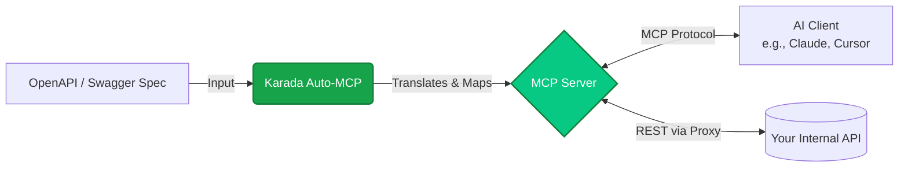

Auto-MCP bridges the gap between traditional REST APIs and modern AI agents (like Claude, Cursor, or ChatGPT) by automatically generating a [Model Context Protocol (MCP)](https://modelcontextprotocol.io) compliant server.

## The Problem

AI models understand natural language and complex reasoning, but they remain isolated. They cannot natively interact with your custom company data, SaaS applications, or internal microservices. To bridge this gap, you typically spend hours writing custom integration code to wrap existing REST APIs into formats the AI can understand.

## The Karada Solution

Karada eliminates this manual integration work. If your API provides an OpenAPI (v3) or Swagger (v2) specification, Karada instantly generates a complete MCP server that acts as a secure bridge between the AI and your API.

### How the Pipeline Works



1. **Intelligent Parsing**: Karada reads your provided `openapi.json` or `swagger.yaml` document.
2. **Schema Translation**: It translates complex JSON Schema objects, query parameters, path variables, and request bodies into native MCP Input Schemas.
3. **Endpoint Mapping**: It maps every API route to a distinct MCP `tool`. The tool description derives automatically from your OpenAPI `summary` and `description` fields, ensuring the LLM knows _exactly_ when and how to use it.
4. **Proxy Generation**: Karada outputs a self-contained executable that handles the entire proxy logic.

---

## Authentication Handling

Most APIs require authentication, such as API Keys, Bearer Tokens, or Basic Auth. Auto-MCP supports passing these credentials dynamically at runtime.

When you start the generated server, pass the required tokens as environment variables:

```bash
# Example: Running a generated server that requires a Bearer token
API_KEY="your-secret-key" npm start
```

Karada automatically inspects the `securitySchemes` in your OpenAPI spec and generates logic that intercepts all outgoing requests from the MCP server to inject the correct headers or query parameters.

---

## Connecting to AI Clients

Once your server runs (either locally or deployed on Karada), configure your AI client to use it.

### Claude Desktop Configuration

To connect your generated Karada server to Claude Desktop, edit your `claude_desktop_config.json` file:

**Mac:** `~/Library/Application Support/Claude/claude_desktop_config.json`  
**Windows:** `%APPDATA%\Claude\claude_desktop_config.json`

Add the following configuration, replacing the paths with the location of your unzipped Karada build:

```json
{
  "mcpServers": {
    "my-karada-api": {
      "command": "node",
      "args": ["/absolute/path/to/your/unzipped/karada-server/build/index.js"],
      "env": {
        "API_KEY": "your-secret-token-if-needed"
      }
    }
  }
}
```

Restart Claude Desktop. You will see a new hammer icon (🛠️) indicating that Claude has full access to your API directly through Karada's generated tools.
