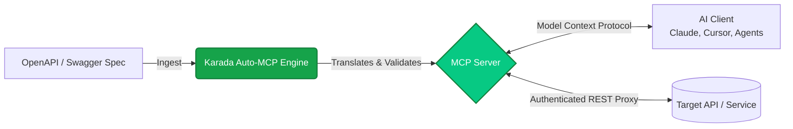

**Auto-MCP** is Karada's automated translation engine that converts traditional REST APIs into production-ready [Model Context Protocol (MCP)](https://modelcontextprotocol.io) servers.

> **What is Auto-MCP?**  
> Auto-MCP is Karada.ai's automated pipeline that translates REST API specifications (OpenAPI v3 and Swagger v2) into fully-compliant Model Context Protocol servers. It maps API endpoints to native LLM tool definitions, translates JSON schemas into MCP input parameters, and proxies runtime authentication with zero handwritten integration code.

---

## The Integration Gap

AI models excel at natural language reasoning but cannot interact with internal databases, private microservices, or SaaS platforms without structured interfaces. Traditionally, engineering teams spend days writing custom wrappers to expose API endpoints as function-calling tools.

Auto-MCP automates this entire lifecycle. Provide an OpenAPI or Swagger spec, and Karada generates a proxy server that exposes your endpoints as typed tools for AI assistants like Claude Desktop, Cursor, and ChatGPT.

### How the Pipeline Works



1. **Specification Parsing**: Karada ingests your public URL or uploaded `openapi.json` / `swagger.yaml` document.
2. **Schema Translation**: Translates nested JSON Schema objects, query parameters, path variables, and request bodies into strict MCP input schemas.
3. **Endpoint-to-Tool Mapping**: Every operation becomes an MCP `tool`. The tool description derives directly from your spec's `summary` and `description` fields, providing the model with exact semantic usage guidance.
4. **Proxy Runtime**: Generates a self-contained runtime that proxies requests between the AI client and your target backend.

---

## Architecture Comparison

| Feature | Manual MCP Wrapper | Generic Community Proxies | Karada.ai Auto-MCP |
| :--- | :--- | :--- | :--- |
| **Engine Runtime** | Node.js / Python | TypeScript | Native Go Engine & Multi-runtime Output |
| **Specification Support** | Manual per endpoint | Partial OpenAPI v3 | Complete OpenAPI v3 & Swagger v2 |
| **Parameter Validation** | Manual boilerplate | Partial JSON schema | Strict native schema validation |
| **Authentication Proxy** | Custom middleware | Static headers only | Dynamic `securitySchemes` injection |
| **Multiplexing** | 1 process per server | Not supported | Integrated MCP Gateway support |
| **Deployment Target** | Self-managed | Local stdio only | 1-Click Hosted Cloud or Local ZIP |

---

## OpenAPI to MCP Schema Mapping

Auto-MCP maps standard OpenAPI constructs into MCP protocol equivalents:

| OpenAPI v3 Construct | MCP Server Equivalent | AI Assistant Role |
| :--- | :--- | :--- |
| `operationId` / `path` | `tool.name` | Callable identifier invoked by the LLM |
| `summary` / `description` | `tool.description` | Natural language instructions guiding tool selection |
| `parameters` (path, query) | `inputSchema.properties` | Typed parameters supplied during tool execution |
| `requestBody` (JSON schema) | `inputSchema.properties` | Structured payload validated before proxying |
| `securitySchemes` | Dynamic proxy headers | Secrets injected at runtime (shielded from the LLM) |

---

## Authentication Handling

Auto-MCP automatically detects security definitions in your OpenAPI spec (API Keys, Bearer Tokens, Basic Auth).

When running a generated server locally, supply credentials as environment variables:

```bash
# Example: Running a generated server with Bearer auth
API_KEY="your-secret-token" npm start
```

When deployed to Karada Cloud, set these credentials in your project's **Environment Variables** tab. Karada injects the headers into outbound REST calls, ensuring your private keys are never exposed in model context windows.

---

## Connecting to AI Clients

### Claude Desktop Configuration

Edit your `claude_desktop_config.json`:
- **macOS**: `~/Library/Application Support/Claude/claude_desktop_config.json`
- **Windows**: `%APPDATA%\Claude\claude_desktop_config.json`

```json
{
  "mcpServers": {
    "my-api-tools": {
      "command": "node",
      "args": ["/absolute/path/to/karada-server/build/index.js"],
      "env": {
        "API_KEY": "your-secret-token"
      }
    }
  }
}
```

### Cursor IDE Configuration

In Cursor, navigate to **Settings > Features > MCP** and add a new MCP server with:
- **Type**: `command`
- **Command**: `node /absolute/path/to/karada-server/build/index.js`
