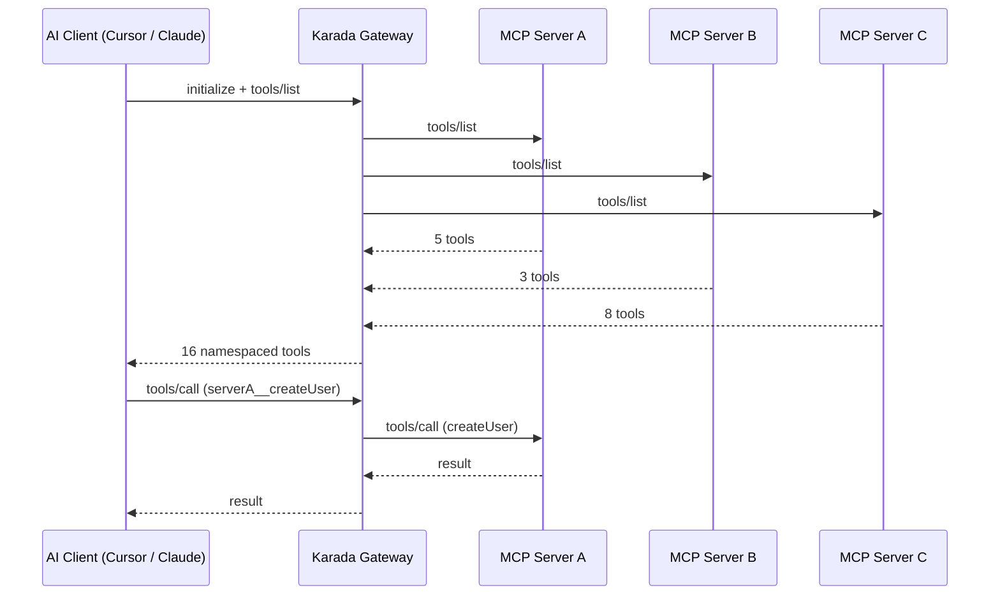

The MCP Gateway is Karada's unified multiplexer — one endpoint that fans out to all your connected MCP servers. Instead of configuring 10–15 separate MCP servers in your AI client, you add **one Karada Gateway URL** and manage everything from the dashboard.

## How the Gateway Works



When your AI client sends a `tools/list` request, the gateway concurrently queries all connected upstreams, merges the results with namespace prefixes (e.g., `stripe__createPayment`, `github__listRepos`), and returns a single unified tool list. Tool calls are automatically routed to the correct upstream.

---

## Multi-Gateway Support

You can create **multiple gateways** to organize tools by context — for example, one gateway for your backend engineering tools and another for your data team's analytics APIs. Each gateway has its own:

- **Authentication token** — unique per gateway
- **Connected MCP servers** — independently managed
- **Toggle controls** — enable or disable individual tools without disconnecting

Switch between gateways in the dashboard's scope switcher or create dedicated tokens for different teams.

---

## Connecting MCP Servers

From the **Tools** tab in your Gateway dashboard, you can connect MCP servers in two ways:

1. **From the Registry** — Browse and connect any server listed in Karada's curated MCP registry with one click.
2. **Custom URL** — Provide any Streamable HTTP MCP server URL. Karada introspects the upstream to discover available tools automatically.

Each connected server gets a **namespace prefix** (e.g., `slack`, `jira`) to prevent tool name collisions across servers.

### Managing Credentials

Many MCP servers require API keys or tokens to access upstream services. The Gateway provides a **secure secret vault** per connected server:

- Set an authentication header name and encrypted secret value
- Karada injects credentials into upstream requests at runtime
- Secrets are encrypted at rest using AES-256-GCM
- Rotate credentials at any time without reconnecting

---

## Autonomous AI Agent

The Gateway includes a built-in **autonomous AI agent** that can plan and execute multi-step tasks across all your connected tools.

Instead of manually invoking tools one by one, describe a task in natural language:

```json
{
  "task": "Find all open PRs in the karada repo and post a summary to Slack",
  "max_steps": 5
}
```

The agent will:

1. Analyze available tools across all connected MCP servers
2. Plan a sequence of tool calls to accomplish the task
3. Execute each step, passing results between tools
4. Return a final response with a full execution trace

The agent runs up to 10 steps per request and can be enabled or disabled per gateway from the dashboard.

---

## Gateway Configuration

### Standard vs Enhanced Mode

Gateways operate in one of two modes, controlled by your billing tier:

- **Standard** — Core multiplexing, tool management, and credential injection.
- **Enhanced** — Adds dynamic tool discovery, the autonomous AI agent, and higher rate limits.

You can toggle between modes from the Gateway settings page.

### Dynamic Discovery

When enabled, the gateway automatically re-introspects connected MCP servers on each `tools/list` request to detect newly added or removed tools upstream. Disable this for faster responses when tool schemas are stable.
