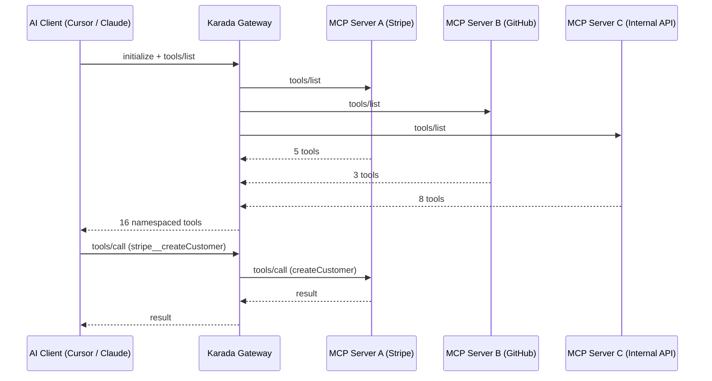

The **MCP Gateway** is Karada's unified multiplexer: a single Streamable HTTP endpoint that fans out to all your connected MCP servers. Instead of maintaining 10–15 individual server configs in your AI client, you add **one Karada Gateway URL** and manage all tool permissions, namespaces, and secrets from a central dashboard.

> **What is the Karada MCP Gateway?**  
> The Karada MCP Gateway is a unified protocol multiplexer that aggregates multiple upstream MCP servers into a single Streamable HTTP endpoint. Instead of configuring separate servers for every tool in Claude Desktop or Cursor, clients connect to one gateway URL that concurrently routes requests, prevents tool name collisions with automatic namespaces, and securely injects credentials.

---

## How the Gateway Works



When your AI client sends a `tools/list` request, the gateway concurrently queries all connected upstreams, merges the results with namespace prefixes (e.g., `stripe__createCustomer`, `github__listRepos`), and returns a single unified tool catalog. Tool calls are automatically validated and routed to the correct upstream service.

---

## Multi-Gateway Architecture

You can create **multiple gateways** to organize tools by team or security context—for instance, one gateway for backend engineering tools and another for finance and analytics APIs. Each gateway provides:

- **Dedicated Authentication Token**: Scoped per gateway endpoint
- **Independent Server Inventory**: Attach only the MCP servers needed for that context
- **Granular Tool Toggles**: Enable or disable specific tools without disconnecting the upstream server

Switch between gateways in the dashboard switcher or issue scoped tokens for different developers and automated workflows.

---

## Connecting MCP Servers

From the **Tools** tab in your Gateway dashboard, connect MCP servers in two ways:

1. **From the Registry**: Browse verified servers in Karada's curated MCP registry and connect with one click.
2. **Custom URL**: Provide any Streamable HTTP or SSE MCP server endpoint. Karada introspects the upstream to discover available tools and parameter schemas automatically.

### Automated Tool Namespacing

To prevent naming collisions when multiple servers define generic tools like `search` or `create_user`, Karada prefixes tool identifiers with the server namespace (e.g., `github__search`, `notion__search`).

### Credential Vault & Runtime Injection

Many upstream MCP servers require API keys or OAuth tokens. The Gateway includes a zero-knowledge secret vault per connected server:

- Define header names and secret values in the dashboard
- Karada injects credentials directly into upstream HTTP requests at the gateway edge
- Secrets are encrypted at rest using AES-256-GCM
- Secrets are shielded from the AI client's context window

---

## Autonomous AI Agent

The Gateway includes a built-in **autonomous AI agent** capable of executing multi-step workflows across your connected tools:

```json
{
  "task": "Find all open PRs in the repository and post a summary to the engineering Slack channel",
  "max_steps": 5
}
```

The agent:
1. Analyzes the merged tool catalog across all connected MCP servers
2. Plans a step-by-step sequence of operations
3. Executes calls sequentially, passing output context between tools
4. Returns a complete execution trace and final synthesized answer

---

## Gateway Configuration Modes

### Standard vs Enhanced Mode

- **Standard**: Core multiplexing, tool routing, namespace isolation, and credential injection.
- **Enhanced**: Adds dynamic real-time tool discovery, autonomous task execution, and higher throughput limits.

### Dynamic Discovery

When enabled, the gateway re-introspects connected upstreams on each `tools/list` request to surface newly added tools immediately. For maximum speed on stable schemas, disable dynamic discovery to serve cached tool manifests instantly.
