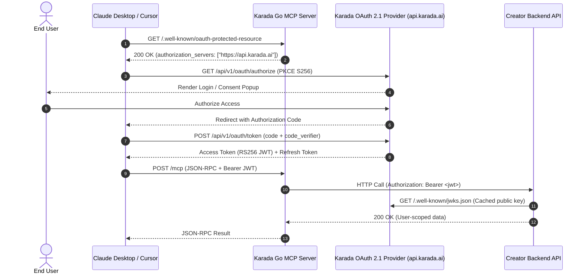

Karada provides an end-to-end **Managed OAuth 2.1 Provider & JWKS Identity Relay Engine**. When end-users interact with your MCP server in Claude Desktop or Cursor, they authenticate seamlessly via a browser popup without sharing static API keys.

Your upstream backend verifies who is making the tool call using standard **Asymmetric RS256 JWKS JWT Verification**.

---

## Authentication Flow



---

## 1-Click AI Implementation Prompt

Copy and paste this prompt directly into **Cursor (Composer / Agent)**, **Claude Code**, or **GitHub Copilot** to auto-implement the auth middleware into your codebase:

```text
Please implement authentication middleware for Karada Managed OAuth 2.1 in our backend codebase:

Context & Specifications:
- Our API receives tool execution requests from an AI Agent via a Karada Go MCP Server.
- The MCP server sends requests with `Authorization: Bearer <token>`.
- Token Issuer: `https://karada.ai`
- Public JWKS Endpoint: `https://api.karada.ai/.well-known/jwks.json`
- Token Claims: `sub` (User UUID), `email` (User Email), `aud` (Client ID), `exp`, `iss`.

Requirements:
1. Create a clean, production-ready middleware matching our backend framework (Express, FastAPI, Chi, Spring, NestJS, etc.).
2. Validate the RS256 Bearer JWT against Karada's public JWKS endpoint (https://api.karada.ai/.well-known/jwks.json).
3. Extract the user identity (`{ id: claims.sub, email: claims.email }`) and attach it to the request context (e.g. `req.user` or request context).
4. Return 401 Unauthorized if the Bearer token is missing, invalid, or expired.
5. Add unit tests verifying valid tokens, expired tokens, and missing credentials.
```

---

## Manual Copy-Paste Middlewares

If you prefer to wire up the middleware manually, choose your backend runtime below.

<Tabs>
  <Tab title="Node.js (Express)">
    Install dependencies:
    ```bash
    npm install express-jwt jwks-rsa jsonwebtoken
    ```

    Middleware implementation:
    ```javascript
    const express = require('express');
    const { expressjwt: jwt } = require('express-jwt');
    const jwksRsa = require('jwks-rsa');

    const app = express();

    // Middleware: Verifies Karada RS256 Bearer JWT against Karada JWKS
    const verifyKaradaAuth = jwt({
      secret: jwksRsa.expressJwtSecret({
        cache: true,
        rateLimit: true,
        jwksRequestsPerMinute: 10,
        jwksUri: 'https://api.karada.ai/.well-known/jwks.json'
      }),
      issuer: 'https://karada.ai',
      algorithms: ['RS256']
    });

    // Protected MCP Upstream Route
    app.get('/api/me', verifyKaradaAuth, (req, res) => {
      // req.auth contains the verified token payload:
      // { sub: "user-uuid", email: "user@example.com", aud: "client_id", iss: "https://karada.ai" }
      const userId = req.auth.sub;
      const userEmail = req.auth.email;

      res.json({
        user_id: userId,
        email: userEmail,
        message: `Authenticated request from user ${userEmail}`
      });
    });

    app.listen(8080, () => console.log('Backend listening on port 8080'));
    ```
  </Tab>

  <Tab title="Python (FastAPI)">
    Install dependencies:
    ```bash
    pip install fastapi uvicorn "pyjwt[crypto]" httpx
    ```

    Middleware implementation:
    ```python
    from fastapi import FastAPI, Depends, HTTPException, Security
    from fastapi.security import HTTPBearer, HTTPAuthorizationCredentials
    import jwt
    import httpx
    from functools import lru_cache

    app = FastAPI()
    security = HTTPBearer()

    JWKS_URL = "https://api.karada.ai/.well-known/jwks.json"
    ISSUER = "https://karada.ai"

    @lru_cache()
    def get_jwks():
        response = httpx.get(JWKS_URL)
        return response.json()

    def verify_karada_token(credentials: HTTPAuthorizationCredentials = Security(security)):
        token = credentials.credentials
        try:
            unverified_header = jwt.get_unverified_header(token)
            jwks = get_jwks()
            
            # Find the matching key by kid
            rsa_key = {}
            for key in jwks["keys"]:
                if key["kid"] == unverified_header["kid"]:
                    rsa_key = jwt.algorithms.RSAAlgorithm.from_jwk(key)
                    break

            if not rsa_key:
                raise HTTPException(status_code=401, detail="Invalid token key ID")

            payload = jwt.decode(
                token,
                key=rsa_key,
                algorithms=["RS256"],
                issuer=ISSUER,
                options={"verify_aud": False}
            )
            return payload
        except jwt.PyJWTError as e:
            raise HTTPException(status_code=401, detail=f"Token verification failed: {str(e)}")

    @app.get("/api/me")
    def get_user_data(user: dict = Depends(verify_karada_token)):
        user_id = user.get("sub")
        email = user.get("email")
        return {"user_id": user_id, "email": email, "status": "authenticated"}
    ```
  </Tab>

  <Tab title="Go (Chi / net/http)">
    Install dependencies:
    ```bash
    go get github.com/lestrrat-go/jwx/v2/jwk
    go get github.com/lestrrat-go/jwx/v2/jwt
    ```

    Middleware implementation:
    ```go
    package main

    import (
    	"context"
    	"fmt"
    	"net/http"
    	"strings"
    	"time"

    	"github.com/lestrrat-go/jwx/v2/jwk"
    	"github.com/lestrrat-go/jwx/v2/jwt"
    )

    const jwksURL = "https://api.karada.ai/.well-known/jwks.json"
    const expectedIssuer = "https://karada.ai"

    func KaradaAuthMiddleware(keySet jwk.Set) func(http.Handler) http.Handler {
    	return func(next http.Handler) http.Handler {
    		return http.HandlerFunc(func(w http.ResponseWriter, r *http.Request) {
    			authHeader := r.Header.Get("Authorization")
    			if authHeader == "" || !strings.HasPrefix(authHeader, "Bearer ") {
    				http.Error(w, "Missing or invalid authorization header", http.StatusUnauthorized)
    				return
    			}

    			tokenStr := strings.TrimPrefix(authHeader, "Bearer ")
    			token, err := jwt.Parse(
    				[]byte(tokenStr),
    				jwt.WithKeySet(keySet),
    				jwt.WithValidate(true),
    				jwt.WithIssuer(expectedIssuer),
    			)
    			if err != nil {
    				http.Error(w, fmt.Sprintf("Invalid JWT: %v", err), http.StatusUnauthorized)
    				return
    			}

    			ctx := context.WithValue(r.Context(), "user_id", token.Subject())
    			if email, ok := token.Get("email"); ok {
    				ctx = context.WithValue(ctx, "user_email", email)
    			}
    			next.ServeHTTP(w, r.WithContext(ctx))
    		})
    	}
    }

    func main() {
    	ctx, cancel := context.WithCancel(context.Background())
    	defer cancel()

    	// Automatic auto-refreshing JWKS cache
    	cache := jwk.NewCache(ctx)
    	cache.Register(jwksURL, jwk.WithMinRefreshInterval(15*time.Minute))
    	keySet, err := cache.Get(ctx, jwksURL)
    	if err != nil {
    		panic(err)
    	}

    	mux := http.NewServeMux()
    	mux.Handle("/api/me", KaradaAuthMiddleware(keySet)(http.HandlerFunc(func(w http.ResponseWriter, r *http.Request) {
    		userId := r.Context().Value("user_id")
    		userEmail := r.Context().Value("user_email")
    		w.Write([]byte(fmt.Sprintf(`{"user_id":"%v","email":"%v"}`, userId, userEmail)))
    	})))

    	http.ListenAndServe(":8080", mux)
    }
    ```
  </Tab>
</Tabs>

---

## Token Metadata & Claims

Karada access tokens are standard OpenID Connect compatible RS256 signed JWTs with the following claims:

```json
{
  "sub": "550e8400-e29b-41d4-a716-446655440000",
  "email": "developer@company.com",
  "aud": "karada_mcp_client_id",
  "iss": "https://karada.ai",
  "scope": "openid email profile",
  "exp": 1727260800,
  "iat": 1727257200
}
```

- `sub`: The unique Karada user identifier (UUID).
- `email`: Verified email address of the authenticated end-user.
- `aud`: Client ID associated with the deployment.
- `iss`: Authoritative issuer URL (`https://karada.ai`).
- `scope`: Granted OAuth scopes.

---

## RFC Discovery Endpoints

Karada publishes standard discovery documents for zero-config client integration:

- **OAuth 2.1 Server Metadata (RFC 8414)**: `https://api.karada.ai/.well-known/oauth-authorization-server`
- **JWKS Key Discovery (RFC 7517)**: `https://api.karada.ai/.well-known/jwks.json`
- **Protected Resource Metadata (RFC 9728)**: Exposed automatically on each generated Go MCP server at `/.well-known/oauth-protected-resource`
